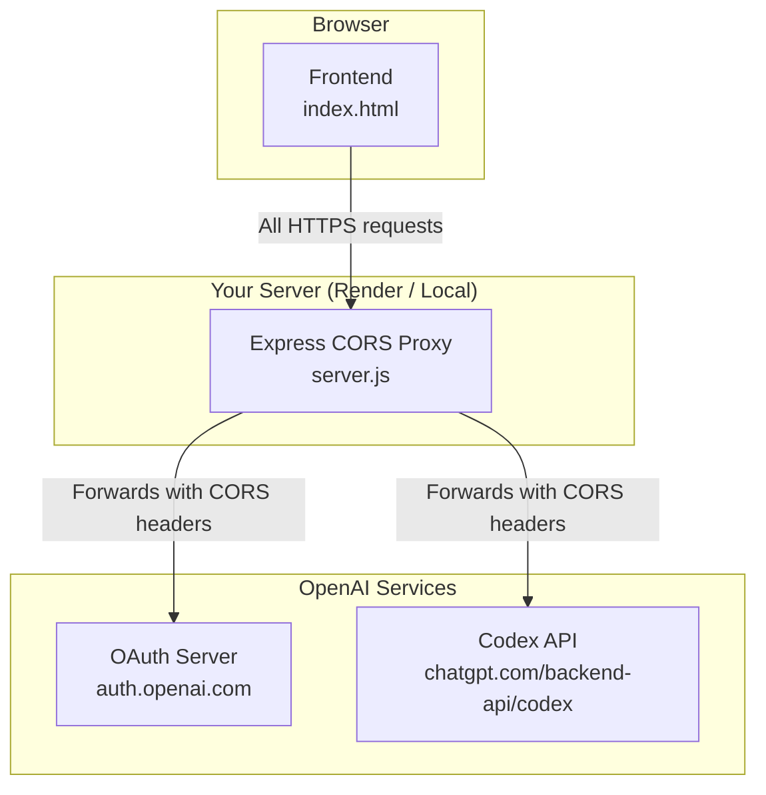
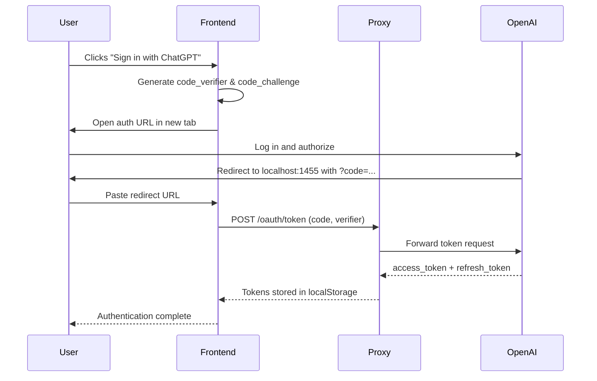

# ChatGPT OAuth – Advanced (Standalone)

A polished, single‑page HTML interface for ChatGPT that uses official OAuth PKCE authentication. It provides a ChatGPT‑like experience with file attachments, vision, live web search, and streaming markdown responses – all using **only** the `gpt-5.6-terra` model.

**Repository:** [https://github.com/kushalkumarj2006/chatgpt-oauth-advanced/](https://github.com/kushalkumarj2006/chatgpt-oauth-advanced/)

  


---

## ✨ Key Features

- **Official OAuth Flow** – Securely log in using your ChatGPT account via PKCE (no API keys required).
- **Fixed Model** – Uses `gpt-5.6-terra`, the most advanced model available.
- **Multi‑Modal Support** – Upload images (Vision), PDFs, code files, and text documents directly in the chat.
- **Agentic Tools** – Toggleable **Web Search** tool to let the AI fetch real‑time information.
- **Streaming Markdown** – Real‑time rendering of markdown responses with syntax highlighting and one‑click code copying.
- **Mobile Responsive** – Designed with a mobile‑first approach, including dynamic viewport heights and iOS‑safe input handling.
- **Self‑Hosted CORS Proxy** – Includes a Node.js Express server (ready for Render) to bypass browser CORS restrictions.

---

## 🏗️ System Architecture

The application consists of three main components:

- **Frontend** – Single‑page HTML/CSS/JS client that handles the UI, PKCE OAuth flow, and chat interaction.
- **CORS Proxy** – A lightweight Node.js/Express server that forwards requests to OpenAI’s OAuth and Codex endpoints, adding necessary CORS headers and spoofing origin/user‑agent.
- **External Services** – OpenAI’s OAuth server (`auth.openai.com`) and the ChatGPT Codex API (`chatgpt.com/backend-api/codex/responses`).

The frontend communicates exclusively through the proxy, which acts as a bridge between the browser and OpenAI.



OAuth PKCE Flow

The authentication flow follows the OAuth 2.0 Authorization Code Grant with PKCE (Proof Key for Code Exchange), which is the official method used by the ChatGPT web client.



---

🚀 Setup Instructions

Step 1: Clone the Repository

```bash
git clone https://github.com/kushalkumarj2006/chatgpt-oauth-advanced.git
cd chatgpt-oauth-advanced
```

Step 2: Deploy Your Own CORS Proxy (Required)

Because browsers block cross‑origin requests, you must run the included proxy server. It is a simple Node.js Express application ready to deploy on Render (or any platform that supports Node.js).

Option A: Deploy on Render (Recommended)

1. Create a free account on Render.com.
2. Click "New +" and select "Web Service".
3. Connect your GitHub repository or upload the code manually.
4. Set the Root Directory to the project root.
5. Render will automatically detect the render/package.json file (ensure you set the Build Command to npm install and Start Command to npm start).
6. Deploy. You will get a public URL like https://chatgpt-oauth-advanced.onrender.com.

Option B: Run Locally for Development

```bash
cd render
npm install
npm start
```

The server will start on port 10000 (or the port defined by PORT environment variable).

Step 3: Configure the Frontend

Open index.html and locate the PROXY constant (around line 415):

```javascript
const PROXY = 'https://chatgpt-oauth-advanced.onrender.com/'; // Replace with your proxy URL
```

Important: Include the trailing slash /.

Step 4: Run the Frontend Locally

The OAuth redirect URI is hardcoded to http://localhost:1455/auth/callback. Therefore, you must serve index.html on that exact port.

Using Python:

```bash
python -m http.server 1455
```

Then open http://localhost:1455 in your browser.

---

🔑 How to Log In

1. Click the "Sign in with ChatGPT" button on the welcome screen.
2. A new tab will open to the official OpenAI login page. Log in with your ChatGPT account.
3. After successful login, you will be redirected to http://localhost:1455/auth/callback?code=...&state=.... This page will not load (this is normal – your local server doesn’t handle that path).
4. Copy the entire URL from your browser's address bar.
5. Paste it into the "Paste the redirect URL after login" input box.
6. Click "Exchange Code for Token".
7. You are now authenticated and can start chatting!

---

🛠️ Tech Stack

· Frontend: HTML5, CSS3, Vanilla JavaScript (ES6+)
· Markdown Rendering: marked.js
· Syntax Highlighting: highlight.js
· Backend Proxy: Node.js + Express
· Deployment: Render (Node.js)
· Fonts: Inter & JetBrains Mono (Google Fonts)

---

⚠️ Disclaimer

This project interfaces with unofficial ChatGPT backend endpoints to provide a standalone client experience. It is intended for educational and personal use. Use it responsibly and at your own risk. The author is not affiliated with OpenAI.

---

📄 License

This project is licensed under the MIT License – see the LICENSE file for details.
